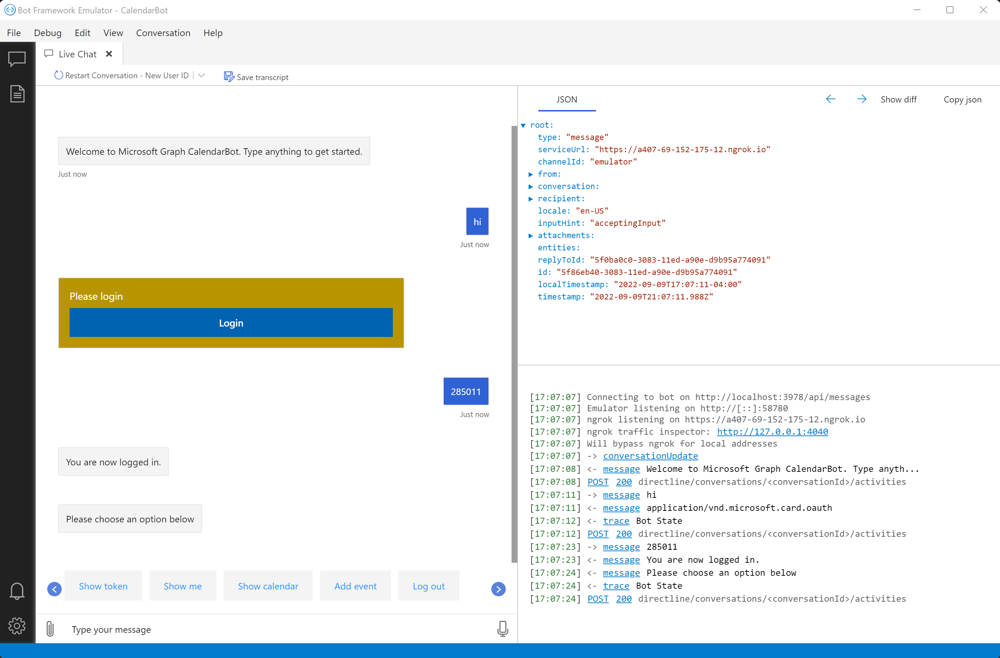

# Microsoft Graph Bot Framework sample

[](https://github.com/microsoftgraph/msgraph-training-botframework/actions/workflows/dotnet.yml) 

This sample demonstrates how to use the Microsoft Graph .NET SDK to access data in Office 365 from Microsoft Bot Framework bots.

> **NOTE:** This sample was originally built from a tutorial published on the [Microsoft Graph tutorials](https://docs.microsoft.com/graph/tutorials) page. That tutorial has been removed.

## Prerequisites

To run the completed project in this folder, you need the following:

- The [.NET Core SDK](https://dotnet.microsoft.com/download) 6.x installed on your development machine.
- [Bot Framework Emulator](https://github.com/microsoft/BotFramework-Emulator)
- [ngrok](https://ngrok.com/)
- Either a personal Microsoft account with a mailbox on Outlook.com, or a Microsoft work or school account with an Exchange Online mailbox.
- An Azure subscription and an account with the **Application developer**, **Application administrator**, **Cloud application administrator**, or **Global administrator** role.

If you don't have a Microsoft account, there are a couple of options to get a free account:

- You can [sign up for a new personal Microsoft account](https://signup.live.com/signup?wa=wsignin1.0&rpsnv=12&ct=1454618383&rver=6.4.6456.0&wp=MBI_SSL_SHARED&wreply=https://mail.live.com/default.aspx&id=64855&cbcxt=mai&bk=1454618383&uiflavor=web&uaid=b213a65b4fdc484382b6622b3ecaa547&mkt=E-US&lc=1033&lic=1).
- You can [sign up for the Microsoft 365 Developer Program](https://developer.microsoft.com/microsoft-365/dev-program) to get a free Office 365 subscription.

If you don't have an Azure subscription, you can [create an account for free](https://azure.microsoft.com/free/?WT.mc_id=A261C142F).

## Create an Azure Bot in Azure portal

1. Open a browser and navigate to the [Azure Portal](https://portal.azure.com). Login using the account associated with your Azure subscription.

1. Select the upper-left menu, then select **Create a resource**.

1. On the **New** page, search for `Azure Bot` and select **Azure Bot**.

1. On the **Azure Bot** page, select **Create**.

1. Fill in the required fields. The **Bot handle** field must be unique. Be sure to review the different pricing tiers and select what makes sense for your scenario. If this is just a learning exercise, you may want to select the free option.

1. For **Type of App**, select **Multi Tenant**.

1. For **Creation type**, select **Create new Microsoft App ID**.

1. Select **Review + create**. Once validation completes, select **Create**.

1. Once deployment has finished, select **Go to resource**.

1. Under **Settings**, select **Configuration**. Select the **Manage** link next to **Microsoft App ID**.

1. Select **New client secret**. Add a description and choose an expiration, then select **Add**.

1. Copy the client secret value before you leave this page. You will need it in the following steps.

    > [!IMPORTANT]
    > This client secret is never shown again, so make sure you copy it now. You will need to enter this value in multiple places so keep it safe.

1. Select **Overview** in the left-hand menu. Copy the value of the **Application (client) ID** and save it, you will need it in the following steps.

### Create a web app registration

1. Return to the home page of the Azure portal, then select **Azure Active Directory**.

1. Select **App registrations**.

1. Select **New registration**. On the **Register an application** page, set the values as follows.

    - Set **Name** to `Graph Calendar Bot Auth`.
    - Set **Supported account types** to **Accounts in any organizational directory and personal Microsoft accounts**.
    - Under **Redirect URI**, set the first drop-down to `Web` and set the value to `https://token.botframework.com/.auth/web/redirect`.

    > **NOTE:** `https://token.botframework.com/.auth/web/redirect` is the default Bot Framework OAuth redirect URL for the public Azure cloud with no data residency requirements. Depending on your environment, you may need to use a different redirect URL. See [OAuth URL support in Azure Bot Service](https://docs.microsoft.com/azure/bot-service/ref-oauth-redirect-urls?view=azure-bot-service-4.0) for more information.

1. Select **Register**. On the **Graph Calendar Bot Auth** page, copy the value of the **Application (client) ID** and save it, you will need it in the following steps.

1. Select **Certificates & secrets** under **Manage**. Select the **New client secret** button. Enter a value in **Description** and select one of the options for **Expires** and select **Add**.

1. Copy the client secret value before you leave this page. You will need it in the following steps.

1. Select **API permissions**, then select **Add a permission**.

1. Select **Microsoft Graph**, then select **Delegated permissions**.

1. Select the following permissions, then select **Add permissions**.

    - **openid**
    - **profile**
    - **Calendars.ReadWrite**
    - **MailboxSettings.Read**

## Configure the sample

1. Create a new file in the **GraphCalendarBot** directory named **appsettings.Development.json** and add the following code.

    ```json
    {
      "MicrosoftAppId": "YOUR_BOT_APP_ID_HERE",
      "MicrosoftAppPassword": "YOUR_BOT_PASSWORD_HERE"
    }
    ```

1. Replace `YOUR_BOT_APP_ID_HERE` with the **Application (client) ID** of your bot. (Step 13 of [Create an Azure Bot in Azure portal](#create-an-azure-bot-in-azure-portal))

1. Replace `YOUR_BOT_PASSWORD_HERE` with the client secret of your bot. (Step 12 of [Create an Azure Bot in Azure portal](#create-an-azure-bot-in-azure-portal))

## Running the sample

You can run this sample from your command-line interface (CLI), Visual Studio Code, or Visual Studio.

### CLI

1. In your CLI, navigate to the **GraphCalendarBot** directory.
1. Run the bot with the following command.

    ```bash
    dotnet run
    ```

### Visual Studio Code

1. In Visual Studio Code, select **File**, then **Open Folder...**.
1. Browse to the folder where you cloned this repository and select **Select Folder**.
1. Select **Run**, then **Start Debugging**. (or press **F5**)

### Visual Studio

1. Open the **GraphCalendarBot.csproj** file in Visual Studio.
1. Press `F5` to run the project.

## Testing the bot using Bot Framework Emulator

1. Open the Bot Framework Emulator. Select the gear icon &#9881; on the bottom left.

1. Enter the local path to your installation of ngrok, and enable the **Bypass ngrok for local addresses** and **Run ngrok when the Emulator starts up** options.

1. Enable the **Use a sign-in verification code for OAuthCards** option. Select **Save**.

1. Select the **File** menu, then **New Bot Configuration...**.

1. Fill in the fields as follows.

    - **Bot name:** `CalendarBot`
    - **Endpoint URL:** `http://localhost:3978/api/messages`
    - **Microsoft App ID:** the application ID of your **Graph Calendar Bot** app registration
    - **Microsoft App password:** your **Graph Calendar Bot** client secret
    - **Encrypt keys stored in your bot configuration:** Enabled

1. Select **Save and connect**. After the emulator connects, you should see `Welcome to Microsoft Graph CalendarBot. Type anything to get started.`

1. Type some text and send it to the bot. The bot responds with a login prompt.

1. Select the **Login** button. The emulator prompts you to confirm the URL that starts with `oauthlink://https://token.botframeworkcom`. Select **Confirm** to continue.

1. In the pop-up window, login with your Microsoft 365 account. Review the requested permissions and accept.

1. Once authentication and consent are complete, the pop-up window provides a validation code. Copy the code and close the window.

1. Enter the validation code in the chat window to complete the login.

1. Try the options presented by the bot after login.



## Code of conduct

This project has adopted the [Microsoft Open Source Code of Conduct](https://opensource.microsoft.com/codeofconduct/). For more information see the [Code of Conduct FAQ](https://opensource.microsoft.com/codeofconduct/faq/) or contact [opencode@microsoft.com](mailto:opencode@microsoft.com) with any additional questions or comments.

## Disclaimer

**THIS CODE IS PROVIDED _AS IS_ WITHOUT WARRANTY OF ANY KIND, EITHER EXPRESS OR IMPLIED, INCLUDING ANY IMPLIED WARRANTIES OF FITNESS FOR A PARTICULAR PURPOSE, MERCHANTABILITY, OR NON-INFRINGEMENT.**
