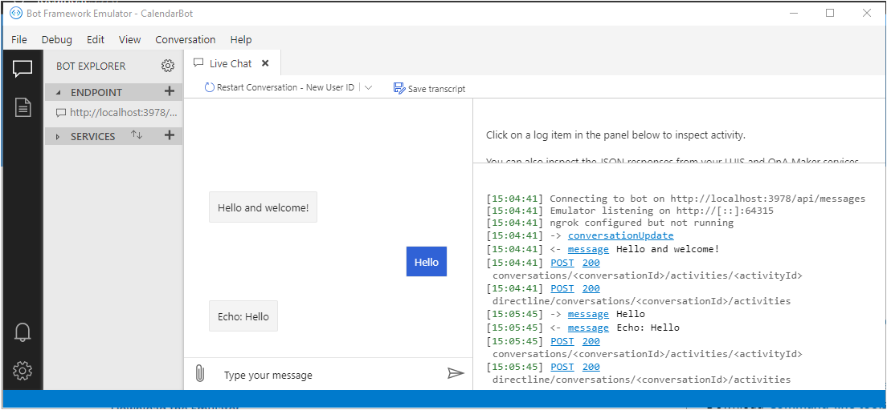

<!-- markdownlint-disable MD002 MD041 -->

In this section you'll create a Bot Framework project.

1. Open your command-line interface (CLI) in a directory where you want to create the project. Run the following command to create new project using the **Microsoft.Bot.Framework.CSharp.EchoBot** template.

    ```dotnetcli
    dotnet new echobot -n GraphCalendarBot
    ```

    > [!NOTE]
    > If you receive an `No templates matched the input template name: echobot.` error, install the template with the following command and re-run the previous command.
    >
    > ```dotnetcli
    > dotnet new -i Microsoft.Bot.Framework.CSharp.EchoBot
    > ```

1. Rename the default **EchoBot** class to **CalendarBot**. Open **./Bots/EchoBot.cs** and replace all instances of `EchoBot` with `CalendarBot`. Rename the file to **CalendarBot.cs**.

1. Replace all instances of `EchoBot` with `CalendarBot` in the remaining **.cs** files.

1. In your CLI, change the current directory to the **GraphCalendarBot** directory and run the following command to confirm the project builds.

    ```dotnetcli
    dotnet build
    ```

## Add NuGet packages

Before moving on, install some additional NuGet packages that you will use later.

- [AdaptiveCards](https://www.nuget.org/packages/AdaptiveCards/) to allow the bot to send Adaptive Cards in responses.
- [Microsoft.Bot.Builder.Dialogs](https://www.nuget.org/packages/Microsoft.Bot.Builder.Dialogs/) to add dialog support to the bot.
- [Microsoft.Graph](https://www.nuget.org/packages/Microsoft.Graph/) for making calls to Microsoft Graph.

1. Run the following commands in your CLI to install the dependencies.

    ```Shell
    dotnet add package AdaptiveCards --version 2.1.0
    dotnet add package Microsoft.Bot.Builder.Dialogs --version 4.10.2
    dotnet add package Microsoft.Graph --version 3.12.0
    ```

## Test the bot

Before adding any code, test the bot to make sure that it works correctly, and that the Bot Framework Emulator is configured to test it.

1. Start the bot by running the following command.

    ```dotnetcli
    dotnet run
    ```

    > [!TIP]
    > While you can use any text editor to edit the source files in the project, we recommend using [Visual Studio Code](https://code.visualstudio.com/). Visual Studio Code offers debugging support, Intellisense, and more. If using Visual Studio Code, you can start the bot using the **Run** -> **Start Debugging** menu.

1. Confirm the bot is running by opening your browser and going to `http://localhost:3978`. You should see a **Your bot is ready!** message.

1. Open the Bot Framework Emulator. Choose the **File** menu, then **Open Bot**.

1. Enter `http://localhost:3978/api/messages` in the **Bot URL**, then select **Connect**.

1. The bot responds with `Hello and welcome!` in the chat window. Send a message to the bot and confirm it echoes it back.

    
