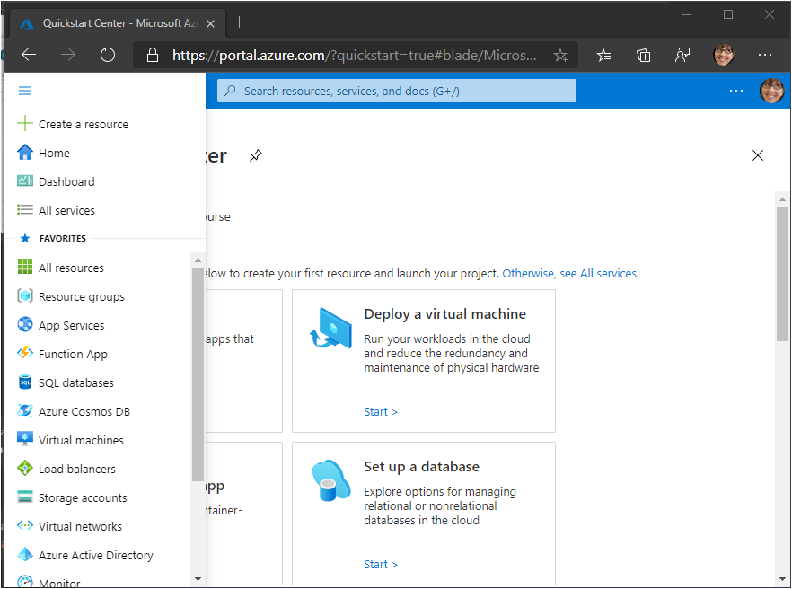
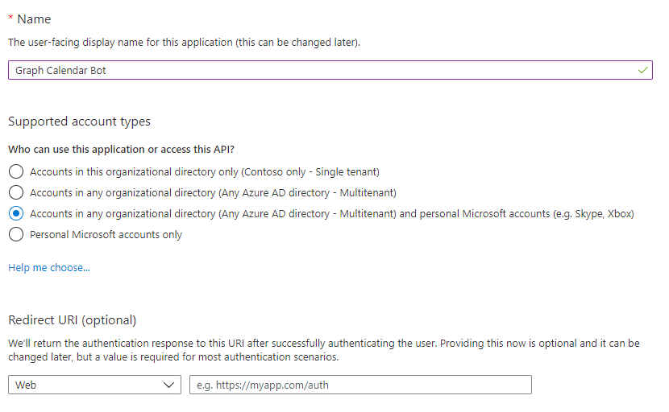
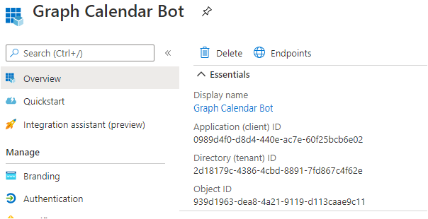
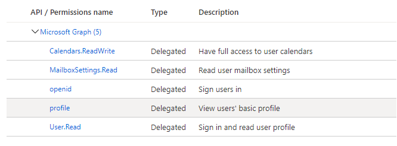

<!-- markdownlint-disable MD002 MD041 -->

In this exercise, you will create a new Bot Channels registration and an Azure AD web application registration using the Azure Portal.

## Create a Bot Channels registration

1. Open a browser and navigate to the [Azure Portal](https://portal.azure.com). Login using the account associated with your Azure subscription.

1. Select the upper-left menu, then select **Create a resource**.

    

1. On the **New** page, search for `Bot Channel` and select **Bot Channels Registration**.

1. On the **Bot Channels Registration** page, select **Create**.

1. Fill in the required fields, and leave **Messaging endpoint** blank. The **Bot handle** field must be unique. Be sure to review the different pricing tiers and select what makes sense for your scenario. If this is just a learning exercise, you may want to select the free option.

1. Select the **Microsoft App ID and password**, then select **Create New**.

1. Select **Create App ID in the App Registration Portal**. This will open a new window or tab to the **App registrations** blade in the Azure Portal.

1. In the **App registrations** blade, select **New registration**.

1. Set the values as follows.

    - Set **Name** to `Graph Calendar Bot`.
    - Set **Supported account types** to **Accounts in any organizational directory and personal Microsoft accounts**.
    - Leave **Redirect URI** empty.

    

1. Select **Register**. On the **Graph Calendar Bot** page, copy the value of the **Application (client) ID** and save it, you will need it in the following steps.

    

1. Select **Certificates & secrets** under **Manage**. Select the **New client secret** button. Enter a value in **Description** and select one of the options for **Expires** and select **Add**.

1. Copy the client secret value before you leave this page. You will need it in the following steps.

    > [!IMPORTANT]
    > This client secret is never shown again, so make sure you copy it now. You will need to enter this value in multiple places so keep it safe.

1. Return to the Bot Channel Registration window in your browser, and paste the application ID into the **Microsoft App ID** field. Paste your client secret into the **Password** field. Select **OK**.

1. On the **Bots Channels Registration** page, select **Create**.

1. Wait for the Bot Channels registration to be created. Once created, return to the Home page in the Azure Portal, then select **Bot Services**. Select your new Bots Channel registration to view its properties.

## Create a web app registration

1. Return to the **App registrations** section of the Azure Portal.

1. Select **New registration**. On the **Register an application** page, set the values as follows.

    - Set **Name** to `Graph Calendar Bot Auth`.
    - Set **Supported account types** to **Accounts in any organizational directory and personal Microsoft accounts**.
    - Under **Redirect URI**, set the first drop-down to `Web` and set the value to `https://token.botframework.com/.auth/web/redirect`.

1. Select **Register**. On the **Graph Calendar Bot Auth** page, copy the value of the **Application (client) ID** and save it, you will need it in the following steps.

1. Select **Certificates & secrets** under **Manage**. Select the **New client secret** button. Enter a value in **Description** and select one of the options for **Expires** and select **Add**.

1. Copy the client secret value before you leave this page. You will need it in the following steps.

1. Select **API permissions**, then select **Add a permission**.

1. Select **Microsoft Graph**, then select **Delegated permissions**.

1. Select the following permissions, then select **Add permissions**.

    - **openid**
    - **profile**
    - **Calendars.ReadWrite**
    - **MailboxSettings.Read**

    

### About permissions

Consider what each of those permission scopes allows the bot to do, and what the bot will use them for.

- **openid** and **profile**: allows the bot to sign users in and get basic information from Azure AD in the identity token.
- **Calendars.ReadWrite**: allows the bot to read the user's calendar and to add new events to the user's calendar.
- **MailboxSettings.Read**: allows the bot to read the user's mailbox settings. The bot will use this to get the user's selected time zone.
- **User.Read**: allows the bot to get the user's profile from Microsoft Graph. The bot will use this to get the user's name.

## Add OAuth connection to the bot

1. Navigate to your bot's Bot Channels Registration page on the Azure Portal. Select **Settings** under **Bot Management**.

1. Under **OAuth Connection Settings** near the bottom of the page, select **Add Setting**.

1. Fill in the form as follows, then select **Save**.

    - **Name**: `GraphBotAuth`
    - **Provider**: **Azure Active Directory v2**
    - **Client id**: The application ID of your **Graph Calendar Bot Auth** registration.
    - **Client secret**: The client secret of your **Graph Calendar Bot Auth** registration.
    - **Token Exchange URL**: Leave blank
    - **Tenant ID**: `common`
    - **Scopes**: `openid profile Calendars.ReadWrite MailboxSettings.Read User.Read`

1. Select the **GraphBotAuth** entry under **OAuth Connection Settings**.

1. Select **Test Connection**. This opens a new browser window or tab to start the OAuth flow.

1. If necessary, sign in. Review the list of requested permissions, then select **Accept**.

1. You should see a **Test Connection to 'GraphBotAuth' Succeeded** message.

> ![TIP]
> You can select the **Copy Token** button on this page, and paste the token into https://jwt.ms to see the claims inside the token. This is useful when troubleshooting authentication errors.
