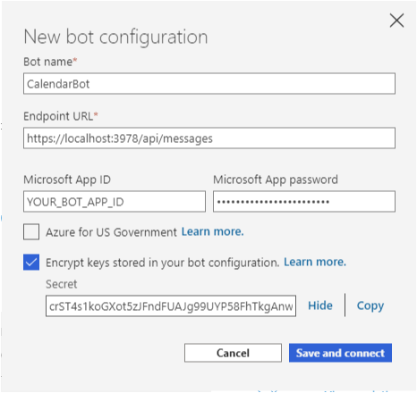
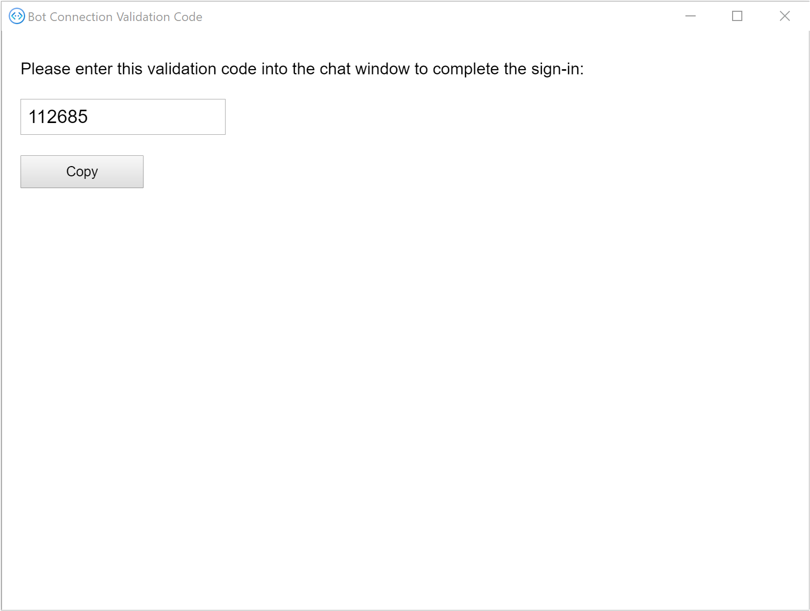
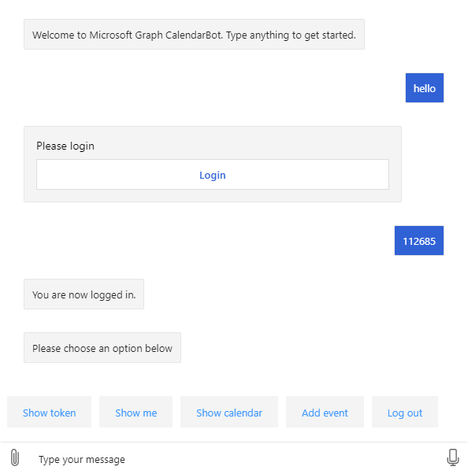

<!-- markdownlint-disable MD002 MD041 -->

In this exercise you will use the Bot Framework's **OAuthPrompt** to implement authentication in the bot, and acquire access tokens for calling the Microsoft Graph API.

1. Open **./appsettings.json** and make the following changes.

    - Change the value of `MicrosoftAppId` to the application ID of your **Graph Calendar Bot** app registration.
    - Change the value of `MicrosoftAppPassword` to your **Graph Calendar Bot** client secret.
    - Add a value named `ConnectionName` with a value of `GraphBotAuth`.

    :::code language="json" source="../demo/GraphCalendarBot/appsettings.example.json":::

    > [!NOTE]
    > If you used a value other than `GraphBotAuth` for the name of your entry in **OAuth Connection Settings** in the Azure Portal, use that value for the `ConnectionName` entry.

## Implement dialogs

1. Create a new directory in the root of the project named **Dialogs**. Create a new file in the **./Dialogs** directory named **LogoutDialog.cs** and add the following code.

    :::code language="csharp" source="../demo/GraphCalendarBot/Dialogs/LogoutDialog.cs" id="LogoutDialogSnippet":::

    This dialog provides a base class for all of the other dialogs in the bot to derive from. This allows the user to log out no matter where they are in the bot's dialogs.

1. Create a new file in the **./Dialogs** directory named **MainDialog.cs** and add the following code.

    ```csharp
    using System.Collections.Generic;
    using System.Threading;
    using System.Threading.Tasks;
    using Microsoft.Bot.Builder;
    using Microsoft.Bot.Builder.Dialogs;
    using Microsoft.Bot.Builder.Dialogs.Choices;
    using Microsoft.Bot.Schema;
    using Microsoft.Extensions.Configuration;
    using Microsoft.Extensions.Logging;

    namespace CalendarBot.Dialogs
    {
        public class MainDialog : LogoutDialog
        {
            const string NO_PROMPT = "no-prompt";
            protected readonly ILogger _logger;

            public MainDialog(IConfiguration configuration, ILogger<MainDialog> logger)
                : base(nameof(MainDialog), configuration["ConnectionName"])
            {
                _logger = logger;

                // OAuthPrompt dialog handles the authentication and token
                // acquisition
                AddDialog(new OAuthPrompt(
                    nameof(OAuthPrompt),
                    new OAuthPromptSettings
                    {
                        ConnectionName = ConnectionName,
                        Text = "Please login",
                        Title = "Login",
                        Timeout = 300000, // User has 5 minutes to login
                    }));

                AddDialog(new ChoicePrompt(nameof(ChoicePrompt)));

                AddDialog(new WaterfallDialog(nameof(WaterfallDialog), new WaterfallStep[]
                {
                    LoginPromptStepAsync,
                    ProcessLoginStepAsync,
                    PromptUserStepAsync,
                    CommandStepAsync,
                    ProcessStepAsync,
                    ReturnToPromptStepAsync
                }));

                // The initial child Dialog to run.
                InitialDialogId = nameof(WaterfallDialog);
            }

            private async Task<DialogTurnResult> LoginPromptStepAsync(
                WaterfallStepContext stepContext,
                CancellationToken cancellationToken)
            {
                // If we're going through the waterfall a second time, don't do an extra OAuthPrompt
                var options = stepContext.Options?.ToString();
                if (options == NO_PROMPT)
                {
                    return await stepContext.NextAsync(cancellationToken: cancellationToken);
                }

                return await stepContext.BeginDialogAsync(nameof(OAuthPrompt), null, cancellationToken);
            }

            private async Task<DialogTurnResult> ProcessLoginStepAsync(
                WaterfallStepContext stepContext,
                CancellationToken cancellationToken)
            {
                // If we're going through the waterfall a second time, don't do an extra OAuthPrompt
                var options = stepContext.Options?.ToString();
                if (options == NO_PROMPT)
                {
                    return await stepContext.NextAsync(cancellationToken: cancellationToken);
                }

                // Get the token from the previous step. If it's there, login was successful
                if (stepContext.Result != null)
                {
                    var tokenResponse = stepContext.Result as TokenResponse;
                    if (!string.IsNullOrEmpty(tokenResponse?.Token))
                    {
                        await stepContext.Context.SendActivityAsync(MessageFactory.Text("You are now logged in."), cancellationToken);
                        return await stepContext.NextAsync(null, cancellationToken);
                    }
                }

                await stepContext.Context.SendActivityAsync(MessageFactory.Text("Login was not successful please try again."), cancellationToken);
                return await stepContext.EndDialogAsync();
            }

            private async Task<DialogTurnResult> PromptUserStepAsync(
                WaterfallStepContext stepContext,
                CancellationToken cancellationToken)
            {
                var options = new PromptOptions
                {
                    Prompt = MessageFactory.Text("Please choose an option below"),
                    Choices = new List<Choice> {
                        new Choice { Value = "Show token" },
                        new Choice { Value = "Show me" },
                        new Choice { Value = "Show calendar" },
                        new Choice { Value = "Add event" },
                        new Choice { Value = "Log out" },
                    }
                };

                return await stepContext.PromptAsync(
                    nameof(ChoicePrompt),
                    options,
                    cancellationToken);
            }

            private async Task<DialogTurnResult> CommandStepAsync(
                WaterfallStepContext stepContext,
                CancellationToken cancellationToken)
            {
                // Save the command the user entered so we can get it back after
                // the OAuthPrompt completes
                var foundChoice = stepContext.Result as FoundChoice;
                // Result could be a FoundChoice (if user selected a choice button)
                // or a string (if user just typed something)
                stepContext.Values["command"] = foundChoice?.Value ?? stepContext.Result;

                // There is no reason to store the token locally in the bot because we can always just call
                // the OAuth prompt to get the token or get a new token if needed. The prompt completes silently
                // if the user is already signed in.
                return await stepContext.BeginDialogAsync(nameof(OAuthPrompt), null, cancellationToken);
            }

            private async Task<DialogTurnResult> ProcessStepAsync(
                WaterfallStepContext stepContext,
                CancellationToken cancellationToken)
            {
                if (stepContext.Result != null)
                {
                    var tokenResponse = stepContext.Result as TokenResponse;

                    // If we have the token use the user is authenticated so we may use it to make API calls.
                    if (tokenResponse?.Token != null)
                    {
                        var command = ((string)stepContext.Values["command"] ?? string.Empty).ToLowerInvariant();

                        if (command.StartsWith("show token"))
                        {
                            // Show the user's token - for testing and troubleshooting
                            // Generally production apps should not display access tokens
                            await stepContext.Context.SendActivityAsync(
                                MessageFactory.Text($"Your token is: {tokenResponse.Token}"),
                                cancellationToken);
                        }
                        else if (command.StartsWith("show me"))
                        {
                            await stepContext.Context.SendActivityAsync(
                                MessageFactory.Text("I don't know how to do this yet!"),
                                cancellationToken);
                        }
                        else if (command.StartsWith("show calendar"))
                        {
                            await stepContext.Context.SendActivityAsync(
                                MessageFactory.Text("I don't know how to do this yet!"),
                                cancellationToken);
                        }
                        else if (command.StartsWith("add event"))
                        {
                            await stepContext.Context.SendActivityAsync(
                                MessageFactory.Text("I don't know how to do this yet!"),
                                cancellationToken);
                        }
                        else
                        {
                            await stepContext.Context.SendActivityAsync(
                                MessageFactory.Text("I'm sorry, I didn't understand. Please try again."),
                                cancellationToken);
                        }
                    }
                }
                else
                {
                    await stepContext.Context.SendActivityAsync(
                        MessageFactory.Text("We couldn't log you in. Please try again later."),
                        cancellationToken);
                    return await stepContext.EndDialogAsync(cancellationToken: cancellationToken);
                }

                // Go to the next step
                return await stepContext.NextAsync(cancellationToken: cancellationToken);
            }

            private async Task<DialogTurnResult> ReturnToPromptStepAsync(
                WaterfallStepContext stepContext,
                CancellationToken cancellationToken)
            {
                // Restart the dialog, but skip the initial login prompt
                return await stepContext.ReplaceDialogAsync(InitialDialogId, NO_PROMPT, cancellationToken);
            }
        }
    }
    ```

    Take a moment to review this code.

    - In the constructor, it sets up a [WaterfallDialog](https://docs.microsoft.com/azure/bot-service/bot-builder-concept-waterfall-dialogs?view=azure-bot-service-4.0) with a set of steps that occur in order.
        - In `LoginPromptStepAsync` it sends an **OAuthPrompt**. If the user isn't logged in, this will send a UI prompt to the user.
        - In `ProcessLoginStepAsync` it checks if the login was successful and sends a confirmation.
        - In `PromptUserStepAsync` it sends a **ChoicePrompt** with the available commands.
        - In `CommandStepAsync` it saves the user's choice, then resends an **OAuthPrompt**.
        - In `ProcessStepAsync` it takes action based on the command received.
        - In `ReturnToPromptStepAsync` it starts the waterfall over, but passes a flag to skip the initial user login.

## Update CalendarBot

The next step is to update **CalendarBot** to use these new dialogs.

1. Open **./Bots/CalendarBot.cs** and replace its entire contents with the following code.

    :::code language="csharp" source="../demo/GraphCalendarBot/Bots/CalendarBot.cs" id="CalendarBotSnippet":::

    Here's a brief summary of the changes.

    - Changed the **CalendarBot** class to be a template class, receiving a **Dialog**.
    - Changed the **CalendarBot** class to extend **TeamsActivityHandler**, allowing it to sign in in Microsoft Teams.
    - Added additional method overrides to enable authentication.

## Update Startup.cs

The final step is to update the `ConfigureServices` method to add the services needed for authentication and the new dialog.

1. Open **./Startup.cs** and remove the `services.AddTransient<IBot, Bots.CalendarBot>();` line from the `ConfigureServices` method.

1. Insert the following code at the end of the `ConfigureServices` method.

    :::code language="csharp" source="../demo/GraphCalendarBot/Startup.cs" id="ConfigureServiceSnippet":::

## Test authentication

1. Save all of your changes and start the bot with `dotnet run`.

1. Open the Bot Framework Emulator. Select the **File** menu, then **New Bot Configuration...**.

1. Fill in the fields as follows.

    - **Bot name:** `CalendarBot`
    - **Endpoint URL:** `https://localhost:3978/api/messages`
    - **Microsoft App ID:** the application ID of your **Graph Calendar Bot** app registration
    - **Microsoft App password:** your **Graph Calendar Bot** client secret
    - **Encrypt keys stored in your bot configuration:** Enabled

    

1. Select **Save and connect**. After the emulator connects, you should see `Welcome to Microsoft Graph CalendarBot. Type anything to get started.`

1. Type some text and send it to the bot. The bot responds with a login prompt.

1. Select the **Login** button. The emulator prompts you to confirm the URL that starts with `oauthlink://https://token.botframeworkcom`. Select **Confirm** to continue.

1. In the pop-up window, login with your Microsoft 365 account. Review the requested permissions and accept.

1. Once authentication and consent are complete, the pop-up window provides a validation code. Copy the code and close the window.

    

1. Enter the validation code in the chat window to complete the login.

    

1. If you select the **Show token** button (or type `show token`), the bot displays the access token. The **Log out** button (or typing `log out`) will log you out.

> [!TIP]
> You may receive the following error message in the Bot Framework Emulator when starting a conversation with the bot.
>
> ```text
> Failed to generate an actual sign-in link: Error: Failed to connect to ngrok instance for OAuth postback URL: FetchError: request to http://127.0.0.1:4041/api/tunnels failed, reason: connect ECONNREFUSED 127.0.0.1:4041
> ```
>
> If this happens, close the emulator and restart it.
