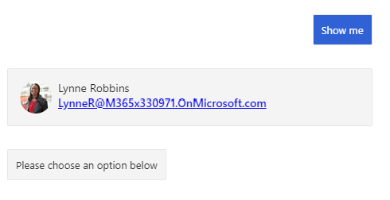

<!-- markdownlint-disable MD002 MD041 -->

In this section you'll use the Microsoft Graph SDK to get the logged-in user.

## Create a Graph service

Start by implementing a service that the bot can use to get a **GraphServiceClient** from the Microsoft Graph SDK, then making that service available to the bot via dependency injection.

1. Create a new directory in the root of the project named **Graph**. Create a new file in the **./Graph** directory named **IGraphClientService.cs** and add the following code.

    :::code language="csharp" source="../demo/GraphCalendarBot/Graph/IGraphClientService.cs" id="IGraphClientServiceSnippet":::

1. Create a new file in the **./Graph** directory named **GraphClientService.cs** and add the following code.

    :::code language="csharp" source="../demo/GraphCalendarBot/Graph/GraphClientService.cs" id="GraphClientServiceSnippet":::

1. Open **./Startup.cs** and add the following `using` statement at the top of the file.

    ```csharp
    using CalendarBot.Graph;
    ```

1. Add the following code to the end of the `ConfigureServices` function.

    :::code language="csharp" source="../demo/GraphCalendarBot/Startup.cs" id="AddGraphServiceSnippet":::

1. Open **./Dialogs/MainDialog.cs**. Add the following `using` statements to the top of the file.

    ```csharp
    using System;
    using System.IO;
    using AdaptiveCards;
    using CalendarBot.Graph;
    using Microsoft.Graph;
    ```

1. Add the following property to the **MainDialog** class.

    ```csharp
    private readonly IGraphClientService _graphClientService;
    ```

1. Locate the constructor for the **MainDialog** class and update its signature to take an **IGraphServiceClient** parameter.

    :::code language="csharp" source="../demo/GraphCalendarBot/Dialogs/MainDialog.cs" id="ConstructorSignatureSnippet" highlight="4":::

1. Add the following code to the constructor.

    ```csharp
    _graphClientService = graphClientService;
    ```

## Get the logged on user

In this section you'll use the Microsoft Graph to get the user's name, email address, and photo. Then you'll create an Adaptive Card to show the information.

1. Create a new file in the root of the project named **CardHelper.cs**. Add the following code to the file.

    ```csharp
    using AdaptiveCards;
    using Microsoft.Graph;
    using System;
    using System.IO;

    namespace CalendarBot
    {
        public class CardHelper
        {
            public static AdaptiveCard GetUserCard(User user, Stream photo)
            {
              // Create an Adaptive Card to display the user
                // See https://adaptivecards.io/designer/ for possibilities
                var userCard = new AdaptiveCard("1.2");

                var columns = new AdaptiveColumnSet();
                userCard.Body.Add(columns);

                var userPhotoColumn = new AdaptiveColumn { Width = AdaptiveColumnWidth.Auto };
                columns.Columns.Add(userPhotoColumn);

                userPhotoColumn.Items.Add(new AdaptiveImage {
                    Style = AdaptiveImageStyle.Person,
                    Size = AdaptiveImageSize.Small,
                    Url = GetDataUriFromPhoto(photo)
                });

                var userInfoColumn = new AdaptiveColumn {Width = AdaptiveColumnWidth.Stretch };
                columns.Columns.Add(userInfoColumn);

                userInfoColumn.Items.Add(new AdaptiveTextBlock {
                    Weight = AdaptiveTextWeight.Bolder,
                    Wrap = true,
                    Text = user.DisplayName
                });

                userInfoColumn.Items.Add(new AdaptiveTextBlock {
                    Spacing = AdaptiveSpacing.None,
                    IsSubtle = true,
                    Wrap = true,
                    Text = user.Mail ?? user.UserPrincipalName
                });

                return userCard;
            }

            private static Uri GetDataUriFromPhoto(Stream photo)
            {
                // Copy to a MemoryStream to get access to bytes
                var photoStream = new MemoryStream();
                photo.CopyTo(photoStream);

                var photoBytes = photoStream.ToArray();

                return new Uri($"data:image/png;base64,{Convert.ToBase64String(photoBytes)}");
            }
        }
    }
    ```

    This code uses the **AdaptiveCard** NuGet package to build an Adaptive Card to display the user.

1. Add the following function to the **MainDialog** class.

    :::code language="csharp" source="../demo/GraphCalendarBot/Dialogs/MainDialog.cs" id="DisplayLoggedInUserSnippet":::

    Consider what this code does.

    - It uses the **graphClient** to [get the logged-in user](https://docs.microsoft.com/graph/api/user-get?view=graph-rest-1.0).
        - It uses the `Select` method to limit which fields are returned.
    - It uses the **graphClient** to [get the user's photo](https://docs.microsoft.com/graph/api/profilephoto-get?view=graph-rest-1.0), requesting the smallest supported size of 48x48 pixels.
    - It uses the **CardHelper** class to construct an Adaptive Card and sends the card as an attachment.

1. Replace the code inside the `else if (command.StartsWith("show me"))` block in `ProcessStepAsync` with the following.

    :::code language="csharp" source="../demo/GraphCalendarBot/Dialogs/MainDialog.cs" id="ShowMeSnippet" highlight="3":::

1. Save all of your changes and restart the bot.

1. Use the Bot Framework Emulator to connect to the bot and log in. Select the **Show me** button to display the logged-on user.

    
