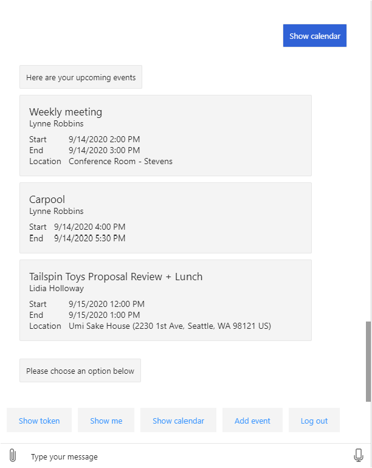

<!-- markdownlint-disable MD002 MD041 -->

In this section you'll use the Microsoft Graph SDK to get the next 3 upcoming events on the user's calendar for the current week.

## Get a calendar view

A calendar view is a list of events on a user's calendar that fall between two date/time values. The advantage of using a calendar view is that it includes any occurrences of recurring meetings.

1. Open **./CardHelper.cs** and add the following function to the **CardHelper** class.

    :::code language="csharp" source="../demo/GraphCalendarBot/CardHelper.cs" id="GetEventCardSnippet":::

    This code builds an Adaptive Card to render a calendar event.

1. Open **./Dialogs/MainDialog.cs** and add the following function to the **MainDialog** class.

    :::code language="csharp" source="../demo/GraphCalendarBot/Dialogs/MainDialog.cs" id="DisplayCalendarViewSnippet":::

    Consider what this code does.

    - It gets the user's **MailboxSettings** to determine the user's preferred time zone and date/time formats.
    - It sets the **startDateTime** and **endDateTime** values to now, and the end of the week, respectively. This defines the window of time that the calendar view uses.
    - It calls `graphClient.Me.CalendarView` with the following details.
        - It sets the `Prefer: outlook.timezone` header to the user's preferred time zone, causing the start and end times for the events to be in the user's timezone.
        - It uses the `Top(3)` method to limit the results to only the first 3 events.
        - It uses `Select` to limit the fields returned to just those fields used by the bot.
        - It uses `OrderBy` to sort the events by start time.
    - It adds an Adaptive Card for each event to the reply message.

1. Replace the code inside the `else if (command.StartsWith("show calendar"))` block in `ProcessStepAsync` with the following.

    :::code language="csharp" source="../demo/GraphCalendarBot/Dialogs/MainDialog.cs" id="ShowCalendarSnippet" highlight="3":::

1. Save all of your changes and restart the bot.

1. Use the Bot Framework Emulator to connect to the bot and log in. Select the **Show calendar** button to display the calendar view.

    
