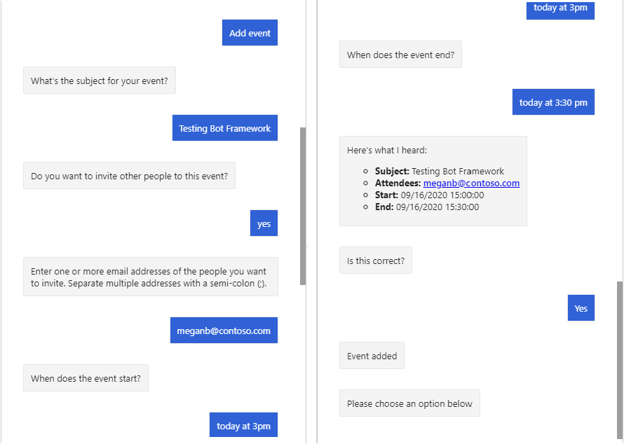

<!-- markdownlint-disable MD002 MD041 -->

In this section you'll use the Microsoft Graph SDK to add an event to the user's calendar.

## Implement a dialog

Start by creating a new custom dialog to prompt the user for the values needed to add an event to their calendar. This dialog will use a **WaterfallDialog** to do the following steps.

- Prompt for a subject
- Ask if the user wants to invite people
- Prompt for attendees (if user said yes to previous step)
- Prompt for a start date and time
- Prompt for an end date and time
- Display all of the collected values and ask user to confirm
- If user confirms, get access token from **OAuthPrompt**
- Create the event

1. Create a new file in the **./Dialogs** directory named **NewEventDialog.cs** and add the following code.

    ```csharp
    using System;
    using System.Collections.Generic;
    using System.Threading;
    using System.Threading.Tasks;
    using CalendarBot.Graph;
    using Microsoft.Bot.Builder;
    using Microsoft.Bot.Builder.Dialogs;
    using Microsoft.Bot.Schema;
    using Microsoft.Extensions.Configuration;
    using Microsoft.Extensions.Logging;
    using Microsoft.Graph;
    using Microsoft.Recognizers.Text.DataTypes.TimexExpression;
    using TimexTypes = Microsoft.Recognizers.Text.DataTypes.TimexExpression.Constants.TimexTypes;

    namespace CalendarBot.Dialogs
    {
        public class NewEventDialog : LogoutDialog
        {
            protected readonly ILogger _logger;
            private readonly IGraphClientService _graphClientService;

            public NewEventDialog(
                IConfiguration configuration,
                IGraphClientService graphClientService)
                : base(nameof(NewEventDialog), configuration["ConnectionName"])
            {

            }

            // Generate a DateTime from the list of
            // DateTimeResolutions provided by the DateTimePrompt
            private static DateTime GetDateTimeFromResolutions(IList<DateTimeResolution> resolutions)
            {
                var timex = new TimexProperty(resolutions[0].Timex);

                // Handle the "now" case
                if (timex.Now ?? false)
                {
                    return DateTime.Now;
                }

                // Otherwise generate a DateTime
                return TimexHelpers.DateFromTimex(timex);
            }
        }
    }
    ```

    This is the shell of a new dialog that will prompt the user for the values needed to add an event to their calendar.

1. Add the following function to the **NewEventDialog** class to prompt the user for a subject.

    :::code language="csharp" source="../demo/GraphCalendarBot/Dialogs/NewEventDialog.cs" id="PromptForSubjectSnippet":::

1. Add the following function to the **NewEventDialog** class to store the subject the user gave in the previous step, and to ask if they want to add attendees.

    :::code language="csharp" source="../demo/GraphCalendarBot/Dialogs/NewEventDialog.cs" id="PromptForAddAttendeesSnippet":::

1. Add the following function to the **NewEventDialog** class to check the user's response from the previous step and prompt the user for a list of attendees if needed.

    :::code language="csharp" source="../demo/GraphCalendarBot/Dialogs/NewEventDialog.cs" id="PromptForAttendeesSnippet":::

1. Add the following function to the **NewEventDialog** class to store the list of attendees from the previous step (if present) and prompt the user for a start date and time.

    :::code language="csharp" source="../demo/GraphCalendarBot/Dialogs/NewEventDialog.cs" id="PromptForStartSnippet":::

1. Add the following function to the **NewEventDialog** class to store the start value from the previous step and prompt the user for an end date and time.

    :::code language="csharp" source="../demo/GraphCalendarBot/Dialogs/NewEventDialog.cs" id="PromptForEndSnippet":::

1. Add the following function to the **NewEventDialog** class to store the end value from the previous step and ask the user to confirm all of the inputs.

    :::code language="csharp" source="../demo/GraphCalendarBot/Dialogs/NewEventDialog.cs" id="ConfirmNewEventSnippet":::

1. Add the following function to the **NewEventDialog** class to check the user's response from the previous step. If the user confirms the inputs, use the **OAuthPrompt** class to get an access token. Otherwise, end the dialog.

    :::code language="csharp" source="../demo/GraphCalendarBot/Dialogs/NewEventDialog.cs" id="GetTokenSnippet":::

1. Add the following function to the **NewEventDialog** class to use the Microsoft Graph SDK to create the new event.

    :::code language="csharp" source="../demo/GraphCalendarBot/Dialogs/NewEventDialog.cs" id="AddEventSnippet":::

    Consider what this code does.

    - It gets the user's **MailboxSettings** to determine the user's preferred time zone.
    - It creates an **Event** object using the values provided by the user. Note that the **Start** and **End** properties are set with the user's time zone.
    - It creates the event on the user's calendar.

## Add validation

Now add validation to the user's input to avoid errors when creating the event with Microsoft Graph. We want to make sure that:

- If the user gives an attendee list, it should be a semicolon-delimited list of valid email addresses.
- The start date/time should be a valid date and time.
- The end date/time should be a valid date and time, and should be later than the start.

1. Add the following function to the **NewEventDialog** class to validate the user's entry for attendees.

    :::code language="csharp" source="../demo/GraphCalendarBot/Dialogs/NewEventDialog.cs" id="AttendeesValidatorSnippet":::

1. Add the following functions to the **NewEventDialog** class to validate the user's entry for start date and time.

    :::code language="csharp" source="../demo/GraphCalendarBot/Dialogs/NewEventDialog.cs" id="StartValidatorSnippet":::

1. Add the following function to the **NewEventDialog** class to validate the user's entry for end date and time.

    :::code language="csharp" source="../demo/GraphCalendarBot/Dialogs/NewEventDialog.cs" id="EndValidatorSnippet":::

## Add steps to WaterfallDialog

Now that you have all of the "steps" for the dialog, the last step is to add them to a **WaterfallDialog** in the constructor, then add the **NewEventDialog** to the **MainDialog**.

1. Locate the **NewEventDialog** constructor and add the following code to it.

    :::code language="csharp" source="../demo/GraphCalendarBot/Dialogs/NewEventDialog.cs" id="ConstructorSnippet":::

    This adds all of the dialogs that are used, and adds all of the functions you implemented as steps in the **WaterfallDialog**.

1. Open **./Dialogs/MainDialog.cs** and add the following line to the constructor.

    ```csharp
    AddDialog(new NewEventDialog(configuration, graphClientService));
    ```

1. Replace the code inside the `else if (command.StartsWith("add event"))` block in `ProcessStepAsync` with the following.

    :::code language="csharp" source="../demo/GraphCalendarBot/Dialogs/MainDialog.cs" id="AddEventSnippet" highlight="3":::

1. Save all of your changes and restart the bot.

1. Use the Bot Framework Emulator to connect to the bot and log in. Select the **Add event** button.

1. Respond to the prompts to create a new event. Note that when prompted for start and end values, you can use phrases like "today at 3PM", or "now".

    
